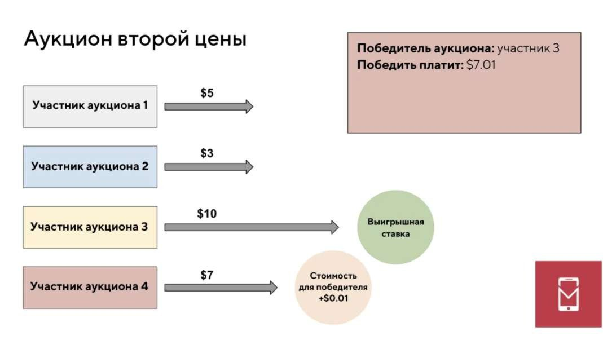

---
## Front matter
lang: ru-RU
title: Доклад
subtitle: "Аукцион второй цены"
author:
  - Машковцева К.С.
institute:
  - Российский университет дружбы народов, Москва, Россия
date: 02 мая 2025

## i18n babel
babel-lang: russian
babel-otherlangs: english

## Formatting pdf
toc: false
toc-title: Содержание
slide_level: 2
aspectratio: 169
section-titles: true
theme: metropolis
header-includes:
 - \metroset{progressbar=frametitle,sectionpage=progressbar,numbering=fraction}
---

# Информация

## Докладчик

:::::::::::::: {.columns align=center}
::: {.column width="70%"}

  * Машковцева Ксения Сергеевна
  * студентка НКНбд-01-22
  * Российский университет дружбы народов

:::
::: {.column width="30%"}

:::
::::::::::::::

# Вводная часть

## Актуальность

В современном мире аукционные модели используются в экономике, цифровых технологиях и бизнесе. Они являются эффективным экономическим инструментом, который позволяет распределять ресурсы, определять справедливую цену товаров и услуг и минимизировать риски.

## Цели и задачи

**Цель**

Исследовать аукцион второй цены и как данная система влияет на истинную оценку предлагаемого товара или услуги.

**Задачи**

* Описать условия аукциона Викри

* Привести математическую модель

* Сравнить с другими аукционами

* Показать применение в реальной жизни

#Основная часть

## Условия проведения

:::::::::::::: {.columns align=center}
::: {.column width="50%"}

1. Участники подают заявки одновременно и анонимно, не зная ставок других

2. Тот, кто предложил наибольшую ставку, выигрывает

3. Тот, кто выиграл, платит не свою ставку, а вторую по величине стоимость

:::
::: {.column width="50%"}

:::
::::::::::::::

## Базовые определения

- <nobr> _N_ = _{1, 2,..., n}_ <nobr> - множество участников аукциона

- <nobr> _V_{i} <nobr> - истинная оценка товара для участника <nobr> i <nobr>

- <nobr> _b_{i} <nobr> - ставка, которую участник <nobr> i <nobr> подает в аукцион

- <nobr> _b_ = _(b~1~, b~2~,..., b~n~)_ <nobr> - вектор всех ставок

## Правила определения победителя и цены

- Победитель - участник с наибольшей ставкой:

$$i_{*} = max(b_{i})$$

- Цена, которую платит победитель - вторая максимальная ставка

$$p = max b_{j}, i \neq j$$

- Для каждого участника i его полезность определяется как:

$$
u_{i}(b_{i},\mathbf{b}_{-i}) = 
\begin{cases} 
v_{i} - p, & \text{если } b_{i} > \max_{j \neq i} b_{j} \\ 
0, & \text{иначе} 
\end{cases}
$$

## Стратегия

Аукцион Викри обладает важным свойством: честная ставка является оптимальной стратегией

* Если участник завышает ставку, есть риск заплатить $p > V_i$ (получить отрицательную полезность)

* Если участник занижает ставку, есть риск проиграть и упустить прибыль

## Сравнительный анализ аукционных моделей

| Характеристика          | Аукцион второй цены (Викри)       | Аукцион первой цены             | Английский аукцион             | Голландский аукцион       |
|-------------------------|----------------------------------|----------------------------------|--------------------------------|--------------------------|
| **Механизм**           | Закрытые ставки, побеждает наивысшая, платит вторую цену | Закрытые ставки, побеждает наивысшая, платит свою цену | Открытые повышающиеся торги | Понижающаяся цена |
| **Стратегия участников** | Оптимально ставить истинную ценность $b_i = v_i$ | Оптимально занижать ставку $b_i < v_i$| Стратегия зависит от поведения других | Оптимально остановиться при $b_i ≈ v_i$ |
| **Эффективность**       | Парето-эффективен               | Может быть неэффективен         | Эффективен                    | Эффективность варьируется |

## Сравнительный анализ аукционных моделей. Продолжение
| **Сложность**           | Низкая                         | Высокая                        | Средняя                       | Средняя                 |
| **Риск переплаты**      | Нет                            | Есть                           | Нет                           | Есть                     |
| **Прозрачность**        | Закрытый                       | Закрытый                       | Открытый                      | Открытый                 |
| **Типичное применение** | Онлайн-реклама, госзакупки     | Тендеры                        | Антиквариат, искусство        | Цветы, скоропортящиеся товары |

# Результаты

1. Стратегическая простота: Викри - единственный где честность оптимальная
2. Эффективность: Викри и английский наиболее эффективны
3. Информационная закрытость: английский и голландский требуют открытого участия
